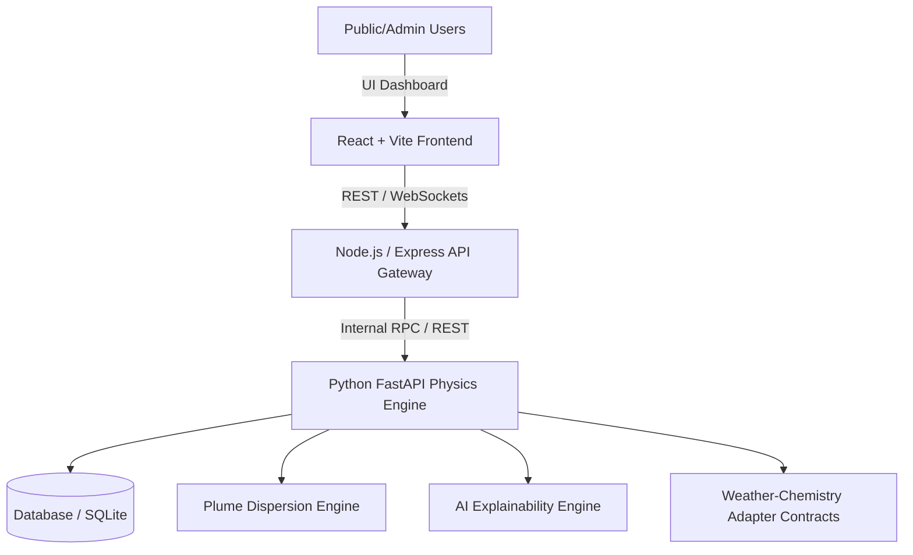

# 🌬️ VayuMitra (वायुमित्र)
> **Air Pollution & Weather Coupled Forecasting System for Delhi NCR**  
> *Developed for Smart India Hackathon (SIH Problem Statement #26082)*

[](https://sih.gov.in)
[](https://nodejs.org/)
[](https://python.org)
[](https://fastapi.tiangolo.com)
[](https://reactjs.org/)

---

## 📌 Overview

**VayuMitra** is a state-of-the-art coupled weather-chemistry forecasting platform engineered specifically for the hyper-local air pollution challenges of the Delhi National Capital Region (NCR). By dynamically linking meteorological conditions (wind dynamics, humidity, planetary boundary layer height, temperature inversions) with atmospheric pollutant chemistry (PM2.5, PM10, NO2, SO2, CO, O3), VayuMitra delivers high-accuracy, predictive AQI intelligence and actionable intervention insights.

---

## ✨ Key Features

- 🌦️ **Coupled Weather-Chemistry Modeling**: Dynamic integration of meteorological predictions with pollutant transport and atmospheric reaction dynamics.
- 💨 **Plume Dispersion & Source Attribution Engine**: Simulates smoke/pollutant dispersion plumes from hotspot sources (e.g., stubble burning in neighboring states, industrial clusters, heavy vehicular corridors).
- 🧠 **AI Explainability Engine (XAI)**: Breaks down AQI forecast drivers, explaining *why* pollution spikes are predicted and attributing weight to specific weather/emission factors.
- 📊 **Interactive Monitoring Dashboard**: Built with React & Tailwind CSS for real-time visualization of AQI spatial heatmaps, time-series forecasting, and emergency alert thresholds.
- ⚡ **Scalable Microservices Architecture**: High-performance Python FastAPI engine handling heavy physics/ML computations paired with a Node.js/Express API gateway.

---

## 🏗️ System Architecture



---

## 🛠️ Tech Stack

- **Frontend**: React, Vite, Tailwind CSS, Lucide Icons, Recharts / Chart.js
- **API Gateway**: Node.js, Express.js
- **Physics & ML Engine**: Python 3.10+, FastAPI, Pytest, SQLite
- **Deployment & DevOps**: Docker, Docker Compose

---

## 📁 Repository Structure

```text
├── backend/            # Node.js API Gateway & Middleware
├── py_backend/         # Python FastAPI Physics, Plume & XAI Engines
│   ├── adapters/       # Weather & Chemistry Data Adapters
│   ├── api/            # API Route Handlers
│   ├── engines/        # Plume Dispersion & Explainability Core Logic
│   ├── models/         # Pydantic Schemas & DB Models
│   └── tests/          # Pytest Suite
├── frontend/           # React + Vite Interactive Dashboard
├── package.json        # Root Monorepo Scripts
└── README.md           # Project Documentation
```

---

## 🚀 Getting Started

### Prerequisites

- **Node.js**: v18.0 or higher
- **Python**: v3.10 or higher
- **Git**

### Installation

1. **Clone the Repository**
   ```bash
   git clone https://github.com/Kishore-16/VayuMitra.git
   cd VayuMitra
   ```

2. **Install Node.js Dependencies**
   ```bash
   npm run install:all
   ```

3. **Install Python Dependencies**
   ```bash
   cd py_backend
   pip install -r requirements.txt
   cd ..
   ```

---

## ⚡ Running Locally

You can launch the core application services concurrently using:

```bash
# Start Node.js API Gateway & React Frontend
npm run dev
```

To run the Python Physics & Forecasting Engine:
```bash
cd py_backend
uvicorn main:app --reload --port 8000
```

---

## 🧪 Running Tests

To run the Python test suite:
```bash
cd py_backend
pytest
```

---

## 📜 License

This project is developed for **Smart India Hackathon (SIH 26082)**. All rights reserved.
